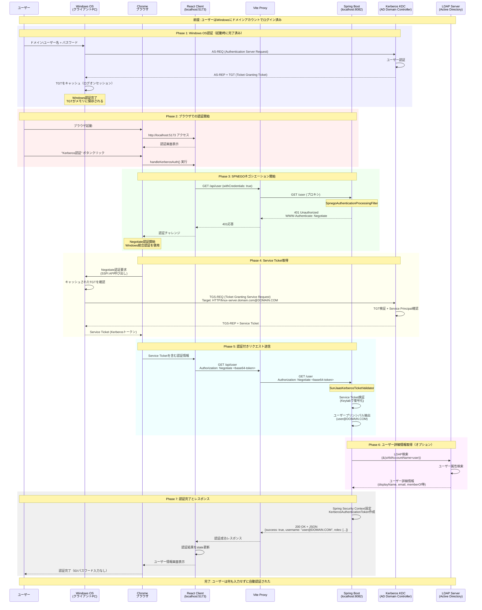
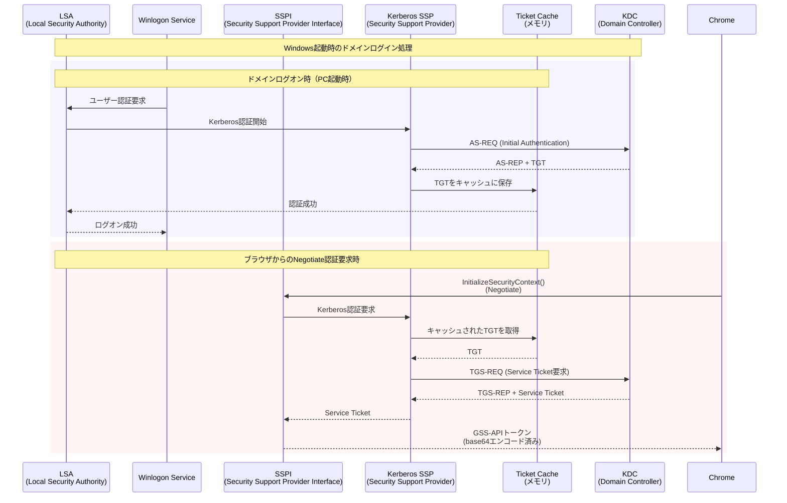

# Kerberos/SPNEGO設定手順（ドメイン参加クライアント + Linux非ドメインサーバー）

## 概要

この設定により、以下が実現できます：
- **クライアント**: Windowsドメイン参加済み、ID/パスワード入力不要
- **サーバー**: Linux、ドメイン非参加、SPNEGOでWindows認証を受け取り

> **技術的な詳細**: Kerberos認証の仕組みや実装の技術仕様については [kerberos-authentication-guide.md](./kerberos-authentication-guide.md) を参照してください。

## 1. Active Directory設定（ドメイン管理者が実施）

### 1.1 サービスプリンシパル名（SPN）の作成
```cmd
# ADドメインコントローラーで実行
setspn -A HTTP/your-linux-server.domain.com adauth-service-account
setspn -A HTTP/your-linux-server adauth-service-account
```

### 1.2 Keytabファイルの生成
```cmd
# ADドメインコントローラーで実行
ktpass -princ HTTP/your-linux-server.domain.com@DOMAIN.COM ^
       -mapuser adauth-service-account@DOMAIN.COM ^
       -crypto AES256-SHA1 ^
       -ptype KRB5_NT_PRINCIPAL ^
       -pass ServiceAccountPassword ^
       -out adauth.keytab
```

### 1.3 KeytabファイルをLinuxサーバーに配置
```bash
# Linuxサーバーで実行
sudo cp adauth.keytab /etc/krb5.keytab
sudo chmod 600 /etc/krb5.keytab
sudo chown root:root /etc/krb5.keytab
```

## 2. Linuxサーバー設定

### 2.1 Kerberos設定ファイル作成
```bash
sudo vi /etc/krb5.conf
```

内容：
```ini
[libdefaults]
    default_realm = DOMAIN.COM
    dns_lookup_realm = false
    dns_lookup_kdc = false
    ticket_lifetime = 24h
    renew_lifetime = 7d
    forwardable = true

[realms]
    DOMAIN.COM = {
        kdc = dc.domain.com
        admin_server = dc.domain.com
        default_domain = domain.com
    }

[domain_realm]
    .domain.com = DOMAIN.COM
    domain.com = DOMAIN.COM

[logging]
    default = FILE:/var/log/krb5libs.log
    kdc = FILE:/var/log/krb5kdc.log
    admin_server = FILE:/var/log/kadmind.log
```

### 2.2 DNS設定（重要）
```bash
# /etc/hosts に追加（または適切なDNS設定）
echo "192.168.1.10  dc.domain.com" >> /etc/hosts
echo "192.168.1.20  your-linux-server.domain.com" >> /etc/hosts
```

### 2.3 時刻同期設定
```bash
# NTPでADドメインコントローラーと時刻同期
sudo ntpdate dc.domain.com
sudo systemctl enable ntp
```

## 3. Spring Boot設定

### 3.1 application-kerberos.properties編集
```properties
# 実際の値に置き換え
kerberos.principal=HTTP/your-linux-server.domain.com@DOMAIN.COM
kerberos.keytab=/etc/krb5.keytab

ad.domain=DOMAIN.COM
ad.url=ldap://dc.domain.com:389

java.security.krb5.realm=DOMAIN.COM
java.security.krb5.kdc=dc.domain.com
```

## 4. 認証フローの詳細

### 4.1 完全なKerberos認証シーケンス図（OS認証含む）



### 4.2 Windows OS内でのKerberos処理詳細



### 4.3 トラブルシューティング：OS認証レベル

#### Windows認証状態の確認
```cmd
# 現在のKerberosチケット一覧
klist

# TGT（Ticket Granting Ticket）の確認
klist tgt

# 特定サービス用チケットの確認
klist get HTTP/linux-server.domain.com

# Kerberosログの有効化（レジストリ設定後、再起動が必要）
reg add "HKLM\SYSTEM\CurrentControlSet\Control\Lsa\Kerberos\Parameters" /v LogLevel /t REG_DWORD /d 1
```

#### SSPI/GSS-API レベルの問題
- **ブラウザのデベロッパーツール**で以下を確認：
  1. 最初のリクエスト: Authorization ヘッダーなし → 401
  2. 2回目のリクエスト: Authorization: Negotiate YII... → 200

- **エラーの場合の一般的なパターン**：
  - "No credentials available": TGTが期限切れ
  - "The target principal name is incorrect": SPN設定エラー  
  - "Clock skew too great": 時刻同期エラー

## 5. 起動とテスト

### 5.1 サーバー起動
```bash
cd /Users/hashiro/nodeprj/winauth/server
./mvnw spring-boot:run -Dspring.profiles.active=kerberos
```

### 5.2 クライアント起動
```bash
cd /Users/hashiro/nodeprj/winauth/client
npm run dev
```

### 5.3 テスト手順
1. ブラウザで `http://localhost:5173` にアクセス
2. "Kerberos認証 (kerberosプロファイル - ポート8082)" を選択
3. "Windows統合認証（Kerberos）" ボタンをクリック
4. ユーザー情報が自動的に表示されることを確認

## 6. トラブルシューティング

### 6.1 よくあるエラー

#### "GSSException: No valid credentials provided"
- Keytabファイルのパスと権限を確認
- SPNが正しく設定されているか確認

#### "Clock skew too great"
- Linuxサーバーの時刻をADドメインコントローラーと同期

#### "Server not found in Kerberos database"
- DNS設定を確認
- /etc/hosts にドメインコントローラーのエントリを追加

### 6.2 デバッグ用コマンド

```bash
# Keytabファイルの内容確認
klist -k /etc/krb5.keytab

# Kerberosチケットの取得テスト
kinit -k -t /etc/krb5.keytab HTTP/your-linux-server.domain.com@DOMAIN.COM

# チケットの確認
klist

# ログの確認
tail -f /var/log/krb5libs.log
```

### 6.3 JVMシステムプロパティ（デバッグ用）
サーバー起動時に以下を追加：
```bash
./mvnw spring-boot:run -Dspring.profiles.active=kerberos \
  -Dsun.security.krb5.debug=true \
  -Djava.security.debug=gssloginconfig,configfile,configparser,logincontext
```

## 7. セキュリティ考慮事項

1. **Keytabファイルの保護**
   - 600権限で保護
   - 定期的なローテーション

2. **HTTPSの使用**
   - 本番環境では必須
   - SSL証明書の適切な設定

3. **ファイアウォール設定**
   - 必要なポートのみ開放
   - 88/tcp, 88/udp (Kerberos)
   - 389/tcp (LDAP)

## 8. 本番環境への適用

1. **負荷分散**
   - 複数サーバーで同じKeytabを共有可能
   - SPNは各サーバーごとに作成

2. **監視**
   - Kerberosチケットの有効期限監視
   - 認証失敗ログの監視

3. **バックアップ**
   - Keytabファイルのバックアップ
   - 設定ファイルのバージョン管理