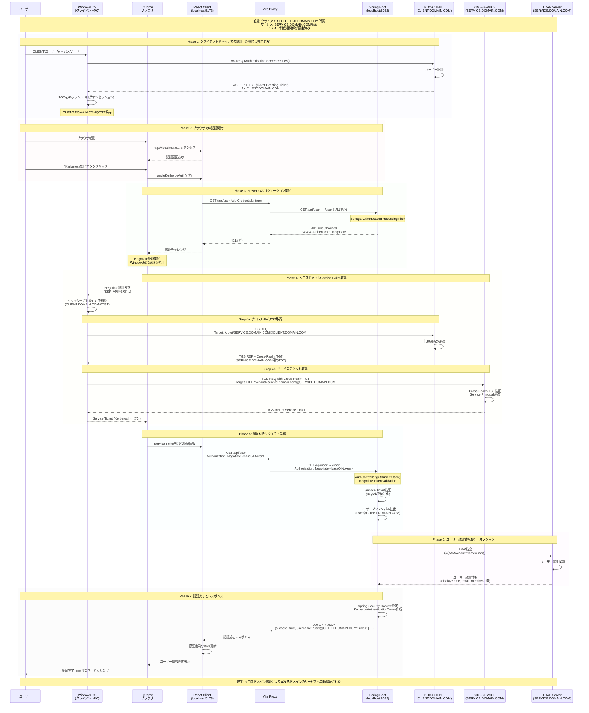
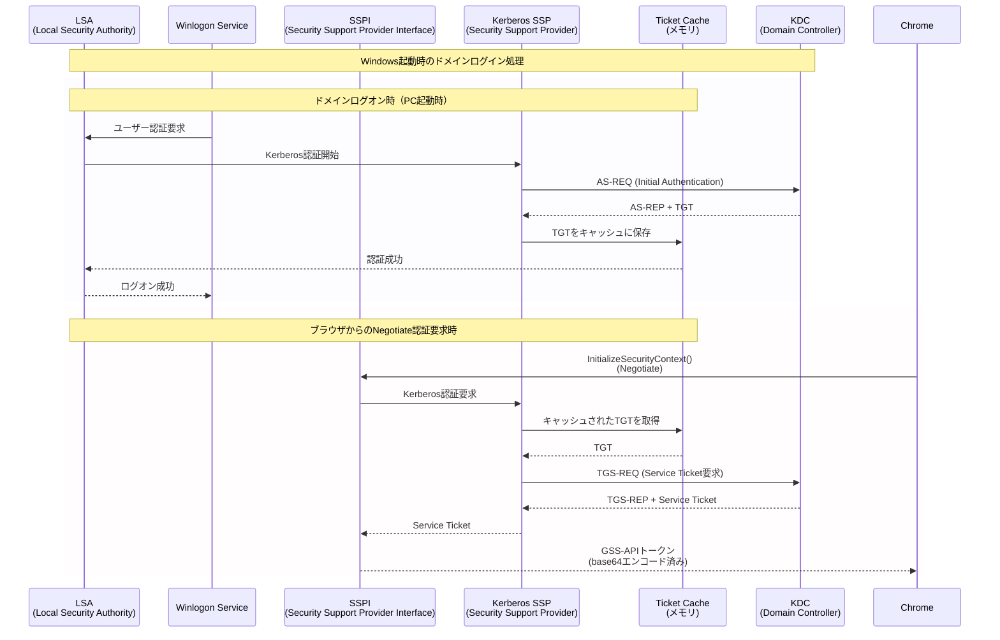

# Kerberos/SPNEGO設定手順（ドメイン参加クライアント + Linux非ドメインサーバー）

## 概要

この設定により、以下が実現できます：
- **クライアント**: Windowsドメイン参加済み、ID/パスワード入力不要
- **サーバー**: Linux、ドメイン非参加、SPNEGOでWindows認証を受け取り

> **技術的な詳細**: Kerberos認証の仕組みや実装の技術仕様については [kerberos-authentication-guide.md](./kerberos-authentication-guide.md) を参照してください。

## 1. Active Directory設定（ドメイン管理者が実施）

### 1.1 サービスアカウントの作成

#### PowerShellでのサービスアカウント作成
```powershell
# ADドメインコントローラーで実行（管理者権限）
# Active Directory PowerShellモジュールをインポート
Import-Module ActiveDirectory

# サービスアカウント作成
New-ADUser -Name "svc-winauth-k8s" `
  -SamAccountName "svc-winauth-k8s" `
  -UserPrincipalName "svc-winauth-k8s@DOMAIN.COM" `
  -DisplayName "WinAuth K8S Service Account" `
  -Description "Service account for Kubernetes WinAuth application" `
  -Path "OU=ServiceAccounts,DC=domain,DC=com" `
  -AccountPassword (ConvertTo-SecureString "P@ssw0rd123!" -AsPlainText -Force) `
  -Enabled $true `
  -PasswordNeverExpires $true `
  -CannotChangePassword $true

# アカウントの確認
Get-ADUser svc-winauth-k8s -Properties *

# 必要に応じてグループに追加
Add-ADGroupMember -Identity "Domain Users" -Members svc-winauth-k8s
```

#### コマンドプロンプトでのサービスアカウント作成（代替方法）
```cmd
# ADドメインコントローラーで実行
# サービスアカウント作成
dsadd user "CN=svc-winauth-k8s,OU=ServiceAccounts,DC=domain,DC=com" ^
  -samid svc-winauth-k8s ^
  -upn svc-winauth-k8s@DOMAIN.COM ^
  -fn "WinAuth" ^
  -ln "K8S Service" ^
  -display "WinAuth K8S Service Account" ^
  -desc "Service account for Kubernetes WinAuth application" ^
  -pwd P@ssw0rd123! ^
  -pwdneverexpires yes ^
  -disabled no

# アカウントの確認
dsquery user -name svc-winauth-k8s
dsget user "CN=svc-winauth-k8s,OU=ServiceAccounts,DC=domain,DC=com" -display -desc -samid
```

#### GUI（Active Directory ユーザーとコンピューター）での作成
1. **Active Directory ユーザーとコンピューター**を開く
2. **ServiceAccounts** OU（または適切なOU）を右クリック
3. **新規作成** → **ユーザー**
4. 以下を入力：
   - 名: `WinAuth`
   - 姓: `K8S Service`
   - ユーザーログオン名: `svc-winauth-k8s`
   - ユーザーログオン名（Windows 2000より前）: `svc-winauth-k8s`
5. パスワード設定：
   - パスワード: `P@ssw0rd123!`（適切な強度のパスワード）
   - ☑ パスワードを無期限にする
   - ☑ ユーザーはパスワードを変更できない
   - ☐ ユーザーは次回ログオン時にパスワード変更が必要
6. **完了**をクリック

### 1.2 サービスプリンシパル名（SPN）の作成

#### K8S環境用のSPN（Ingress使用）
```cmd
# ADドメインコントローラーで実行
# メインSPN - Ingress経由の外部アクセス用（必須）
setspn -A HTTP/winauth.example.com svc-winauth-k8s

# 追加のIngress用ドメイン（複数ドメインがある場合）
setspn -A HTTP/auth.company.com svc-winauth-k8s

# 確認
setspn -L svc-winauth-k8s

# 重複SPNのチェック（重要）
setspn -X

# --- 以下は参考（K8S内部通信が必要な場合のみ） ---
# K8S Service内部通信用（通常は不要）
# setspn -A HTTP/winauth-service.winauth.svc.cluster.local svc-winauth-k8s
```

#### PowerShellでのSPN設定（代替方法）
```powershell
# SPNを設定
Set-ADUser -Identity svc-winauth-k8s -ServicePrincipalNames @{
    Add="HTTP/winauth-service.winauth.svc.cluster.local",
        "HTTP/winauth.example.com",
        "HTTP/winauth-service"
}

# SPNの確認
Get-ADUser svc-winauth-k8s -Properties ServicePrincipalNames | 
    Select-Object -ExpandProperty ServicePrincipalNames
```

**重要**: Ingress使用時のSPN設定：
- `HTTP/winauth.example.com` - メインSPN（Ingressドメイン）
- `HTTP/auth.company.com` - 追加ドメイン（必要に応じて）

**注意**: K8S内部Service名（`winauth-service.winauth.svc.cluster.local`）のSPNは通常不要です。クライアントはIngress経由でアクセスするため。

### 1.2 Keytabファイルの生成

#### Ingress用のKeytab生成（推奨）
```cmd
# ADドメインコントローラーで実行
# メインドメイン用のKeytab作成
ktpass -princ HTTP/winauth.example.com@DOMAIN.COM ^
       -mapuser svc-winauth-k8s@DOMAIN.COM ^
       -crypto AES256-SHA1 ^
       -ptype KRB5_NT_PRINCIPAL ^
       -pass ServiceAccountPassword ^
       -out winauth.keytab

# 複数ドメインがある場合の追加
ktpass -princ HTTP/auth.company.com@DOMAIN.COM ^
       -mapuser svc-winauth-k8s@DOMAIN.COM ^
       -crypto AES256-SHA1 ^
       -ptype KRB5_NT_PRINCIPAL ^
       -pass ServiceAccountPassword ^
       -out winauth.keytab ^
       -in winauth.keytab

# --- 参考: K8S内部Service用（通常は不要） ---
# ktpass -princ HTTP/winauth-service.winauth.svc.cluster.local@DOMAIN.COM ^
#        -mapuser svc-winauth-k8s@DOMAIN.COM ^
#        -crypto AES256-SHA1 ^
#        -ptype KRB5_NT_PRINCIPAL ^
#        -pass ServiceAccountPassword ^
#        -out winauth-internal.keytab

# 生成されたKeytabの確認（Windows）
ktpass -? | findstr keytab
```

**注意事項**:
- 同じサービスアカウントに複数のSPNを紐付ける場合、`-in`オプションで既存のkeytabに追加
- パスワードは全SPNで同一である必要があります
- 実際のIngress FQDNに合わせてドメイン名を変更してください
- K8S内部Service用のSPNは、Pod間直接通信が必要な特殊な場合のみ設定

### 1.3 KeytabファイルをKubernetesに配置
```bash
# KeytabファイルをSecretとして作成
kubectl create secret generic kerberos-keytab \
  --from-file=krb5.keytab=adauth.keytab \
  -n winauth

# 確認
kubectl get secret kerberos-keytab -n winauth
```

## 2. Kubernetes環境設定

### 2.1 Namespace作成
```bash
kubectl create namespace winauth
```

### 2.2 Kerberos設定ファイル作成（ConfigMap）
```bash
# ConfigMapを適用
kubectl apply -f k8s/configmap.yaml

# 確認
kubectl get configmap krb5-config -n winauth -o yaml
```

ConfigMapの内容（k8s/configmap.yaml）に含まれる設定：
- Kerberos設定（krb5.conf）
- アプリケーション設定（application-kerberos.yaml）

### 2.2 DNS設定（重要）
```bash
# /etc/hosts に追加（または適切なDNS設定）
echo "192.168.1.10  dc.domain.com" >> /etc/hosts
echo "192.168.1.20  your-linux-server.domain.com" >> /etc/hosts
```

### 2.3 時刻同期の設定（重要）

Kerberos認証では時刻同期が必須です（5分以内の誤差）。

#### Kubernetes Podでの時刻同期
```yaml
# deployment.yamlに追加
spec:
  containers:
  - name: winauth
    env:
    - name: TZ
      value: "Asia/Tokyo"  # または適切なタイムゾーン
```

#### ホストノードの時刻同期確認
```bash
# Kubernetesノードで実行
# NTPサービスの状態確認
systemctl status chronyd
# または
systemctl status systemd-timesyncd

# 時刻同期状態の確認
timedatectl status

# ドメインコントローラーとの時刻差確認
ntpdate -q dc.domain.com
```

### 2.4 K8S環境へのデプロイ

#### Secret作成（Keytab）
```bash
# Keytabファイルをbase64エンコード
cat adauth.keytab | base64 -w 0 > keytab.b64

# SecretのYAMLを編集して適用
kubectl apply -f k8s/secret.yaml
```

#### Deployment適用
```bash
# すべてのK8Sリソースを適用
kubectl apply -f k8s/

# デプロイ状況確認
kubectl get all -n winauth

# Pod のログ確認
kubectl logs -f deployment/winauth-server -n winauth
```

### 2.4 時刻同期設定（K8Sノード）
```bash
# 各K8Sノードで実行（重要）
sudo ntpdate dc.domain.com
sudo systemctl enable ntp
```

## 3. Spring Boot設定

### 3.1 K8S環境用の設定

#### ConfigMap経由での設定（k8s/configmap.yaml）
```yaml
data:
  application-kerberos.yaml: |
    kerberos:
      # Ingress用のプリンシパル（メイン）
      principal: HTTP/winauth.example.com@DOMAIN.COM
      keytab: /etc/krb5/krb5.keytab
    
    ad:
      domain: DOMAIN.COM
      url: ldap://dc.domain.com:389
      searchBase: DC=domain,DC=com
```

#### 環境変数での設定（deployment.yaml）
```yaml
env:
- name: KERBEROS_PRINCIPAL
  value: "HTTP/winauth.example.com@DOMAIN.COM"
- name: KERBEROS_KEYTAB
  value: "/etc/krb5/krb5.keytab"
```

### 3.2 複数SPN対応（Ingress使用時）

外部アクセス用に複数のSPNをサポートする場合：

```properties
# プライマリSPN（K8S内部）
kerberos.principal=HTTP/winauth-service.winauth.svc.cluster.local@DOMAIN.COM

# 追加SPN（Ingress経由）
kerberos.additional.spns=HTTP/winauth.example.com@DOMAIN.COM
```

## 4. 認証フローの詳細

### 4.1 クロスドメインKerberos認証シーケンス図（異なるドメイン間の認証）



### 4.2 ドメイン間信頼関係の設定

クロスドメインKerberos認証を実現するには、ドメイン間の信頼関係が必要です：

#### 必要な信頼関係
```
CLIENT.DOMAIN.COM ←→ SERVICE.DOMAIN.COM
（双方向の信頼または単方向の信頼）
```

#### Active Directoryでの信頼設定（管理者権限必要）
```powershell
# SERVICE.DOMAIN.COMのドメインコントローラーで実行
# CLIENT.DOMAIN.COMからの信頼を受け入れる
New-ADTrust -Name "CLIENT.DOMAIN.COM" `
  -Type Forest `
  -Direction Bidirectional `
  -LocalForestCredential (Get-Credential) `
  -RemoteForestCredential (Get-Credential)
```

#### SPNの設定（SERVICE.DOMAIN.COM側）
```cmd
# サービスアカウントはSERVICE.DOMAIN.COMに作成
setspn -A HTTP/winauth.service.domain.com svc-winauth@SERVICE.DOMAIN.COM
```

#### Keytabの生成（SERVICE.DOMAIN.COM側）
```cmd
ktpass /out winauth.keytab `
  /princ HTTP/winauth.service.domain.com@SERVICE.DOMAIN.COM `
  /mapuser svc-winauth@SERVICE.DOMAIN.COM `
  /pass Password123! `
  /ptype KRB5_NT_PRINCIPAL `
  /crypto AES256-SHA1
```

### 4.3 Windows OS内でのKerberos処理詳細



### 4.3 トラブルシューティング：OS認証レベル

#### Windows認証状態の確認
```cmd
# 現在のKerberosチケット一覧
klist

# TGT（Ticket Granting Ticket）の確認
klist tgt

# 特定サービス用チケットの確認
klist get HTTP/linux-server.domain.com

# Kerberosログの有効化（レジストリ設定後、再起動が必要）
reg add "HKLM\SYSTEM\CurrentControlSet\Control\Lsa\Kerberos\Parameters" /v LogLevel /t REG_DWORD /d 1
```

#### SSPI/GSS-API レベルの問題
- **ブラウザのデベロッパーツール**で以下を確認：
  1. 最初のリクエスト: Authorization ヘッダーなし → 401
  2. 2回目のリクエスト: Authorization: Negotiate YII... → 200

- **エラーの場合の一般的なパターン**：
  - "No credentials available": TGTが期限切れ
  - "The target principal name is incorrect": SPN設定エラー  
  - "Clock skew too great": 時刻同期エラー

## 5. 起動とテスト

### 5.1 サーバー起動
```bash
cd /Users/hashiro/nodeprj/winauth/server
./mvnw spring-boot:run -Dspring.profiles.active=kerberos
```

### 5.2 クライアント起動
```bash
cd /Users/hashiro/nodeprj/winauth/client
npm run dev
```

### 5.3 テスト手順
1. ブラウザで `http://localhost:5173` にアクセス
2. "Kerberos認証 (kerberosプロファイル - ポート8082)" を選択
3. "Windows統合認証（Kerberos）" ボタンをクリック
4. ユーザー情報が自動的に表示されることを確認

## 6. トラブルシューティング

### 6.1 よくあるエラー

#### "GSSException: No valid credentials provided"
- Keytabファイルのパスと権限を確認
- SPNが正しく設定されているか確認

#### "Clock skew too great"
- Linuxサーバーの時刻をADドメインコントローラーと同期

#### "Server not found in Kerberos database"
- DNS設定を確認
- /etc/hosts にドメインコントローラーのエントリを追加

### 6.2 デバッグ用コマンド

```bash
# Keytabファイルの内容確認
klist -k /etc/krb5.keytab

# Kerberosチケットの取得テスト
kinit -k -t /etc/krb5.keytab HTTP/your-linux-server.domain.com@DOMAIN.COM

# チケットの確認
klist

# ログの確認
tail -f /var/log/krb5libs.log
```

### 6.3 JVMシステムプロパティ（デバッグ用）
サーバー起動時に以下を追加：
```bash
./mvnw spring-boot:run -Dspring.profiles.active=kerberos \
  -Dsun.security.krb5.debug=true \
  -Djava.security.debug=gssloginconfig,configfile,configparser,logincontext
```

## 7. セキュリティ考慮事項

1. **Keytabファイルの保護**
   - 600権限で保護
   - 定期的なローテーション

2. **HTTPSの使用**
   - 本番環境では必須
   - SSL証明書の適切な設定

3. **ファイアウォール設定**
   - 必要なポートのみ開放
   - 88/tcp, 88/udp (Kerberos)
   - 389/tcp (LDAP)

## 8. 本番環境への適用

1. **負荷分散**
   - 複数サーバーで同じKeytabを共有可能
   - SPNは各サーバーごとに作成

2. **監視**
   - Kerberosチケットの有効期限監視
   - 認証失敗ログの監視

3. **バックアップ**
   - Keytabファイルのバックアップ
   - 設定ファイルのバージョン管理