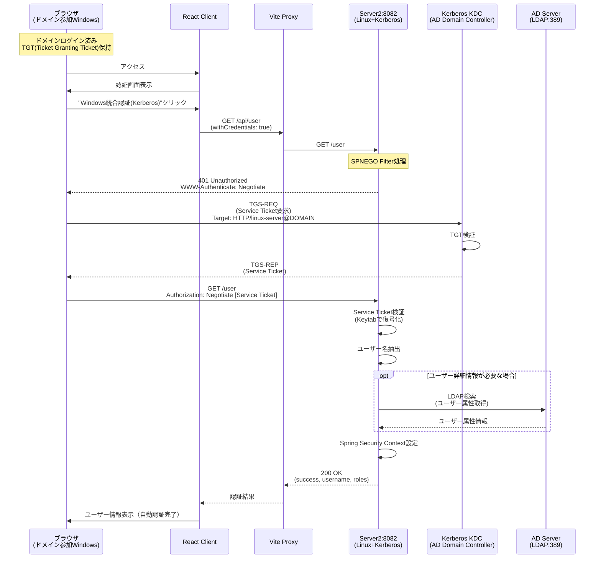
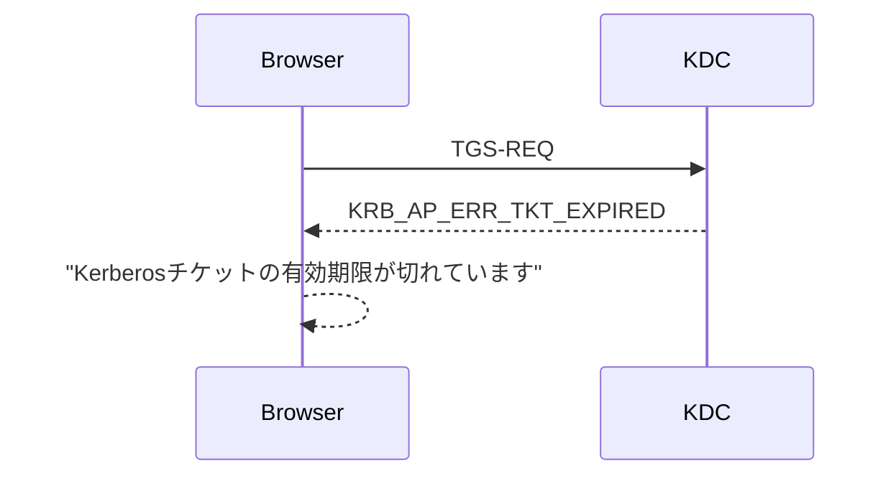
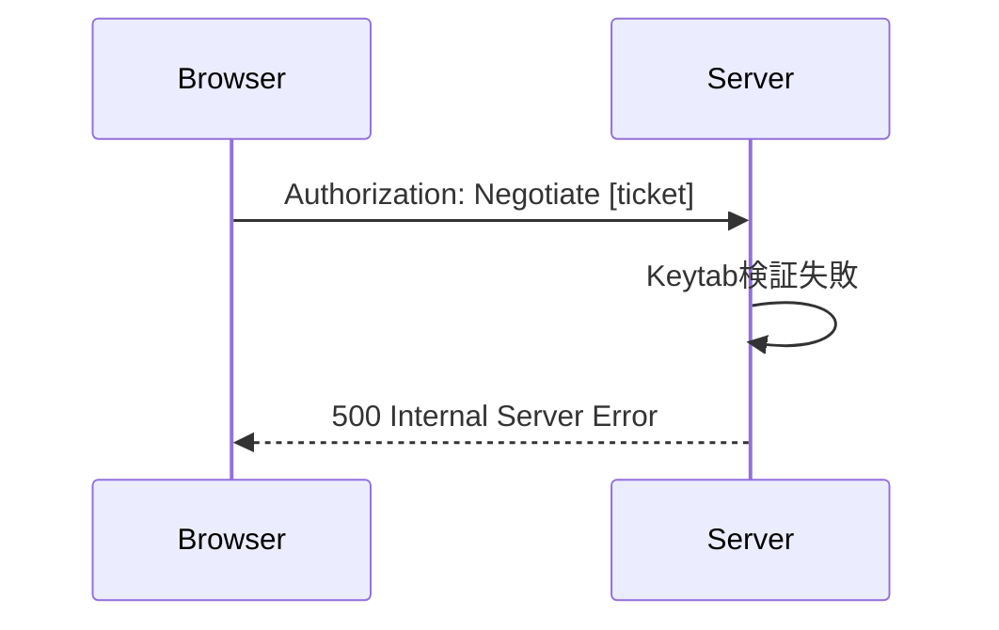
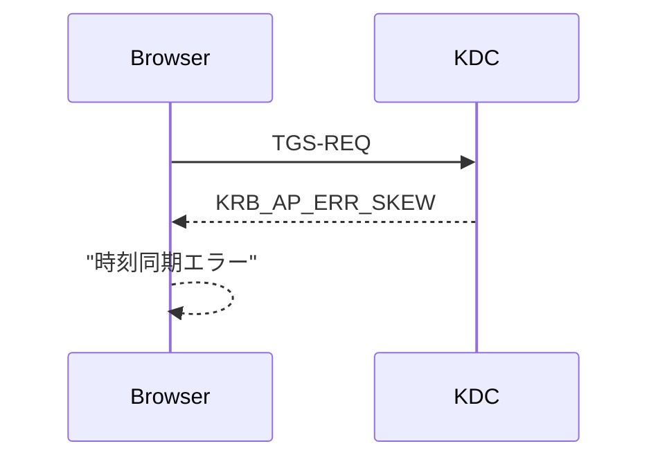
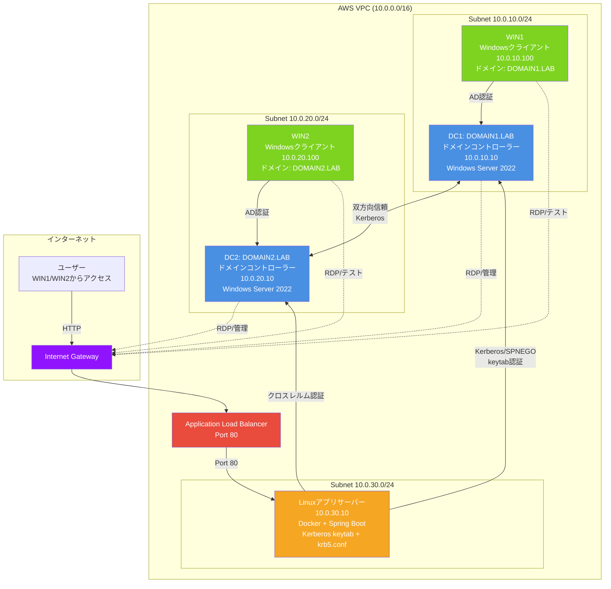
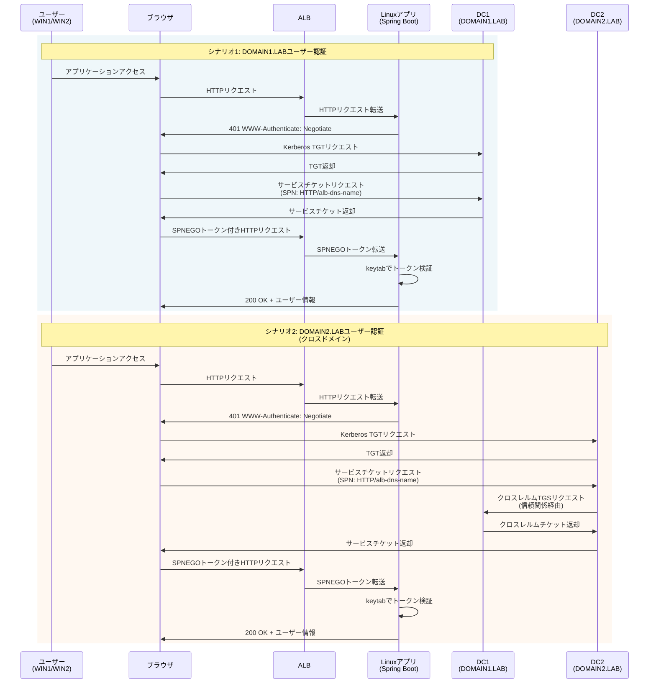

# 第2章: Kerberos認証詳解

## 2.1 概要

Kerberos認証は、ドメイン参加クライアント + コンテナ化されたアプリケーションでのSPNEGO（Simple and Protected GSSAPI Negotiation Mechanism）を使用した自動認証を実現します。

### 特徴
- **ユーザー体験**: ID/パスワードの入力なしで自動認証
- **技術基盤**: Windows Kerberos + コンテナ + Spring Security
- **セキュリティ**: 強固なKerberos認証による SSO

### システム構成
- **サーバー**: コンテナ環境、非ドメイン参加、Keytab配置
- **クライアント**: Windowsクライアント、ドメイン参加必須
- **認証方式**: Kerberos (SPNEGO)
- **ユーザー操作**: 不要（自動認証）

## 2.2 アーキテクチャとシーケンス

### 認証フロー



## 2.3 技術仕様

### 2.3.1 SPN (Service Principal Name)

SPNはKerberos認証におけるサービス識別子です。

**形式**: `サービス種別/ホスト名@レルム名`

**例**:
```
HTTP/winauth-alb-123456.ap-northeast-1.elb.amazonaws.com@DOMAIN1.LAB
```

**重要な制約**:
- SPNはActive Directoryフォレスト内で**一意**である必要がある
- 同じSPNを複数ドメインに登録することは**できない**
- この制約がクロスドメイン認証の主な課題となる

**補足**: Windows Server上でアプリケーションを動作させる場合、サーバーがドメイン参加していればSPN登録もKeytabファイルも不要です。しかし、本プロジェクトではLinux/コンテナ環境で動作させるため、SPNの手動登録とKeytabファイルの配置が必要になります。

### 2.3.2 Keytabファイル

Keytabは、サーバー認証用の暗号化された認証情報を含むファイルです。

**特性**:
- **作成場所**: Active Directoryドメインコントローラー
- **配置場所**: コンテナ内の`/config/winauth.keytab`（ボリュームマウント）
- **権限**: 600 (読み書き制限)
- **内容**: サービスプリンシパル用の暗号化キー

**セキュリティ要件**:
- ファイル権限を厳密に管理（600）
- 定期的なパスワード変更とKeytab再作成
- ホストシステムでは`/opt/winauth/app-config/`に配置し、コンテナにマウント

### 2.3.3 krb5.conf設定

Kerberos設定ファイルの例：

```ini
[libdefaults]
    default_realm = DOMAIN1.LAB
    dns_lookup_realm = false
    dns_lookup_kdc = false
    ticket_lifetime = 24h
    renew_lifetime = 7d
    forwardable = true
    allow_weak_crypto = true

[realms]
    DOMAIN1.LAB = {
        kdc = 10.0.10.10
        admin_server = 10.0.10.10
    }
    DOMAIN2.LAB = {
        kdc = 10.0.20.20
        admin_server = 10.0.20.20
    }

[domain_realm]
    .domain1.lab = DOMAIN1.LAB
    domain1.lab = DOMAIN1.LAB
    .domain2.lab = DOMAIN2.LAB
    domain2.lab = DOMAIN2.LAB
```

## 2.4 Kerberos暗号化方式とJava 17での対応

### 2.4.1 Kerberos暗号化方式について

**暗号化が使用される場所**:
Kerberos認証では、以下の通信で暗号化が使用されます：
- **チケット発行時**: クライアントとKDC（Key Distribution Center）間の通信
- **サービスチケット**: クライアントとアプリケーションサーバー間で使用されるチケットの暗号化
- **Keytabファイル**: サーバー側で保持する認証情報の暗号化

これらの暗号化方式（RC4やAES256など）は、Active Directoryとアプリケーションサーバー間で一致している必要があります。

**現在の標準: AES暗号化**:
- 現在のActive Directory環境では、Kerberos認証の暗号化方式としてAES256が標準
- AES (Advanced Encryption Standard) は、RC4に代わる強固な暗号化アルゴリズム
- Windows Server 2008以降、AES256がデフォルトで使用される

**RC4暗号化について**:
- RC4 (Rivest Cipher 4) は、古い暗号化アルゴリズム
- セキュリティ上の脆弱性が発見され、現在は非推奨
- しかし、一部の古いActive Directory環境では引き続き使用されている場合がある

### 2.4.2 Java 17での制約

**Java 17の変更**:
- Java 17では、セキュリティ強化のため、RC4暗号化がデフォルトで無効化された
- 通常、Active Directory環境がAES256を使用していればこの問題は発生しない

**RC4を必要とする場合**:
RC4の有効化が必要になるのは、以下のような状況です：

1. **古いActive Directory環境との接続**: Windows Server 2003など、AES256に対応していない古いドメインコントローラーとの接続が必要な場合
2. **既存AD環境の暗号化設定変更が困難**: セキュリティポリシーや運用上の制約により、既存のActive Directory環境でAES256への移行が即座にできない場合
3. **レガシーシステムとの互換性維持**: RC4を使用する他のレガシーシステムとの互換性を保つ必要がある場合

### 2.4.3 RC4を必要とする場合の対応

RC4が必要な環境では、Java側でRC4を許可する設定を行います。

**エラー例**:
```
Encryption type RC4 with HMAC is not supported/enabled
```

#### krb5.conf設定
```ini
[libdefaults]
    default_realm = DOMAIN1.LAB
    allow_weak_crypto = true  # RC4を許可
```

#### JVM起動オプション
```bash
-Djava.security.krb5.allow_weak_crypto=true
-Dsun.security.krb5.disableReferrals=true
-Djava.security.krb5.conf=/etc/krb5.conf
```

#### Dockerコンテナ環境変数
```yaml
environment:
  - JAVA_TOOL_OPTIONS=-Djava.security.krb5.conf=/config/krb5.conf
  - KRB5_CONFIG=/config/krb5.conf
```

**セキュリティ上の注意**:
- RC4の使用は一時的な対応と位置づけることを推奨します
- 可能であれば、Active Directory環境をAES256に移行することを検討してください
- 本番環境ではHTTPSの使用が必須です

## 2.5 Spring Security設定

### 必要なライブラリ
- Spring Security Kerberos
- KerberosAuthenticationProvider
- SpnegoAuthenticationProcessingFilter

### application.properties
```properties
# Kerberos設定
kerberos.principal=HTTP/${ALB_DNS_NAME}@DOMAIN1.LAB
kerberos.keytab=/config/winauth.keytab
kerberos.debug=true

# AD/LDAP設定
ad.domain=DOMAIN1.LAB
ad.url=ldap://10.0.10.10:389
ad.user-search-base=DC=domain1,DC=lab
ad.user-search-filter=sAMAccountName={0}

# サーバー設定
server.port=8082
```

### SecurityConfig.java（抜粋）
```java
@Configuration
@EnableWebSecurity
public class KerberosConfig {

    @Value("${kerberos.principal}")
    private String servicePrincipal;

    @Value("${kerberos.keytab}")
    private String keytabLocation;

    @Bean
    public SpnegoAuthenticationProcessingFilter spnegoAuthenticationProcessingFilter(
            AuthenticationManager authenticationManager) {
        SpnegoAuthenticationProcessingFilter filter =
            new SpnegoAuthenticationProcessingFilter();
        filter.setAuthenticationManager(authenticationManager);
        return filter;
    }

    @Bean
    public SunJaasKerberosTicketValidator sunJaasKerberosTicketValidator() {
        SunJaasKerberosTicketValidator ticketValidator =
            new SunJaasKerberosTicketValidator();
        ticketValidator.setServicePrincipal(servicePrincipal);
        ticketValidator.setKeyTabLocation(new FileSystemResource(keytabLocation));
        ticketValidator.setDebug(true);
        return ticketValidator;
    }
}
```

## 2.6 エラーパターン

### パターン1: Kerberosチケット取得失敗


### パターン2: Keytab/SPN設定エラー


### パターン3: 時刻同期エラー


## 2.7 デバッグ設定

### アプリケーションログ
```properties
# application.properties
logging.level.org.springframework.security.kerberos=DEBUG
logging.level.org.springframework.security.web=DEBUG
kerberos.debug=true
```

### JVM デバッグオプション
```bash
-Dsun.security.krb5.debug=true
-Djava.security.debug=gssloginconfig,configfile,configparser,logincontext
```

### Kerberos動作確認
```bash
# 手動でのKerberos認証テスト
kinit username@DOMAIN.LAB
klist
kvno HTTP/linux-server.domain.lab@DOMAIN.LAB
```

## 2.8 セキュリティ考慮事項

### 時刻同期
- **厳密な時刻同期**: ADドメインコントローラーとの時刻差5分以内
- **NTPサービス**: 安定したNTPサーバーとの同期
- **監視**: 時刻ずれの監視とアラート

### ネットワークセキュリティ
- **DNS設定**: 正しいDNS設定とDNSSEC
- **ファイアウォール**: 必要なポートのみ開放（88, 389, 636）
- **HTTPS**: 本番環境では必須

### SPN管理
- **一意性**: SPNの重複を避ける
- **命名規則**: 一貫したSPN命名規則
- **定期監査**: SPN設定の定期確認

## 2.9 AWS環境でのシステム構成

### 2.9.1 ネットワーク構成

```
AWS VPC (10.0.0.0/16)
├── Subnet 10.0.10.0/24 (AZ-a)
│   ├── DC1 (DOMAIN1.LAB) - 10.0.10.10
│   └── WIN1 (クライアント) - 10.0.10.100
├── Subnet 10.0.20.0/24 (AZ-c)
│   ├── DC2 (DOMAIN2.LAB) - 10.0.20.10
│   └── WIN2 (クライアント) - 10.0.20.100
├── Subnet 10.0.30.0/24 (AZ-a)
│   └── Linux App Server - 10.0.30.10
├── Subnet 10.0.40.0/24 (AZ-c)
│   └── (予備)
└── Application Load Balancer
    └── Target: Linux App Server:80
```

### 2.9.2 システム構成図



### 2.9.3 Kerberos認証フロー



### 2.9.4 コンポーネント詳細

| コンポーネント | インスタンスタイプ | OS | 用途 | 推定コスト/月 |
|--------------|------------------|-----|------|-----------|
| DC1 | t3.medium | Windows Server 2022 | DOMAIN1.LABドメインコントローラー | 約$30 |
| DC2 | t3.medium | Windows Server 2022 | DOMAIN2.LABドメインコントローラー | 約$30 |
| WIN1 | t3.small | Windows Server 2022 | DOMAIN1.LABテストクライアント | 約$15 |
| WIN2 | t3.small | Windows Server 2022 | DOMAIN2.LABテストクライアント | 約$15 |
| Linux App | t3.medium | Amazon Linux 2023 | アプリケーションサーバー<br/>(Docker + Spring Boot) | 約$30 |
| ALB | - | - | Application Load Balancer | 約$20 |
| ネットワーク | - | - | VPC、サブネット、IGW | 約$5 |
| **合計** | - | - | - | **約$145/月** |

## 次の章へ

- [第3章: NTLM認証詳解](./03_NTLM.md) - NTLM認証の実装ガイド
- [第4章: クロスドメイン認証](./04_CROSS_DOMAIN.md) - クロスドメイン環境での認証課題と解決策
- [第5章: 環境別セットアップ](./05_SETUP.md) - 実際の環境構築手順
