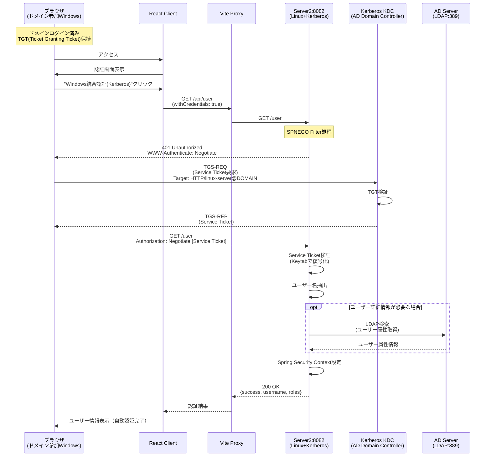
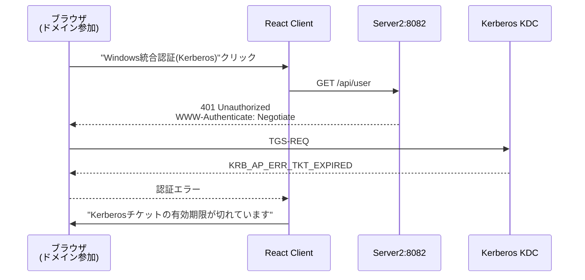
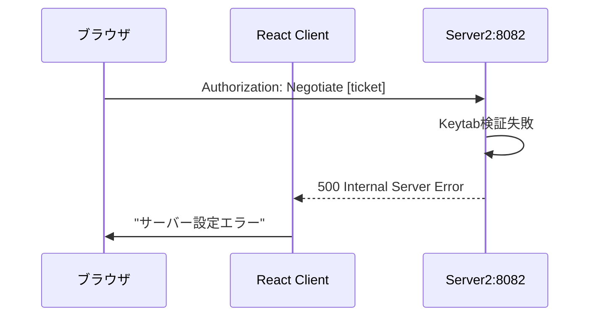
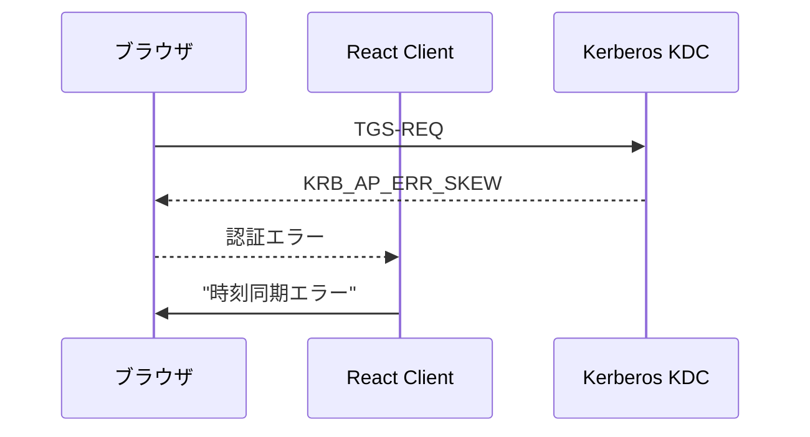

# Kerberos自動認証 実装・運用ガイド

## 概要
このガイドでは、ドメイン参加クライアント + Linux非ドメインサーバーでのKerberos自動認証（SPNEGO）の技術的な実装詳細と運用について説明します。

> **セットアップ手順**: 実際の環境構築手順については [KERBEROS_SETUP.md](./KERBEROS_SETUP.md) を参照してください。

このパターンでは：
- **ユーザー体験**: ID/パスワードの入力なしで自動認証
- **技術基盤**: Windows Kerberos + Linux SPNEGO + Spring Security
- **セキュリティ**: 強固なKerberos認証による SSO

## アーキテクチャ
**前提**: ドメイン参加クライアント + Linux非ドメインサーバー

### システム構成
- **サーバー**: Linuxサーバー、非ドメイン参加、Keytab配置
- **クライアント**: Windowsクライアント、ドメイン参加必須
- **認証方式**: Kerberos (SPNEGO)
- **ユーザー操作**: 不要（自動認証）

## シーケンス図



## 技術仕様

> **実装例**: このガイドの設定例を実際の環境で使用する場合は、[KERBEROS_SETUP.md](./KERBEROS_SETUP.md) の具体的なセットアップ手順も併せて実行してください。

### 必要なライブラリ
- **Spring Security Kerberos**: メイン認証ライブラリ
- **認証プロバイダー**: KerberosAuthenticationProvider
- **フィルター**: SpnegoAuthenticationProcessingFilter

### サーバー設定

#### Spring Boot設定 (application.properties)
```properties
# Kerberos設定
kerberos.principal=HTTP/server.domain.com@DOMAIN.COM
kerberos.keytab=/etc/krb5.keytab
kerberos.debug=true

# AD/LDAP設定
ad.domain=DOMAIN.COM
ad.url=ldap://dc.domain.com:389
ad.user-search-base=DC=domain,DC=com
ad.user-search-filter=sAMAccountName={0}

# サーバー設定
server.port=8082
```

#### Krb5設定ファイル (/etc/krb5.conf)
```ini
[libdefaults]
    default_realm = DOMAIN.COM
    dns_lookup_realm = false
    dns_lookup_kdc = false
    ticket_lifetime = 24h
    renew_lifetime = 7d
    forwardable = true

[realms]
    DOMAIN.COM = {
        kdc = dc1.domain.com
        kdc = dc2.domain.com
        admin_server = dc1.domain.com
    }

[domain_realm]
    .domain.com = DOMAIN.COM
    domain.com = DOMAIN.COM
```

### 必要なファイル
1. **`/etc/krb5.conf`** - Kerberos設定ファイル
2. **`/etc/krb5.keytab`** - サービスアカウント認証情報（権限600）

### Keytab設定概要

Keytabファイルは、サーバー認証用の暗号化された認証情報を含むファイルです：

- **作成場所**: Active Directoryドメインコントローラー
- **配置場所**: Linuxサーバーの`/etc/krb5.keytab`
- **権限**: 600 (root読み書きのみ)
- **内容**: サービスプリンシパル用の暗号化キー

> **詳細な作成手順**: [KERBEROS_SETUP.md](./KERBEROS_SETUP.md#12-keytabファイルの生成) を参照

## Spring Security設定例

### SecurityConfig.java
```java
@Configuration
@EnableWebSecurity
public class KerberosConfig {

    @Value("${kerberos.principal}")
    private String servicePrincipal;

    @Value("${kerberos.keytab}")
    private String keytabLocation;

    @Bean
    public SpnegoEntryPoint spnegoEntryPoint() {
        return new SpnegoEntryPoint("/login");
    }

    @Bean
    public SpnegoAuthenticationProcessingFilter spnegoAuthenticationProcessingFilter(
            AuthenticationManager authenticationManager) {
        SpnegoAuthenticationProcessingFilter filter = 
            new SpnegoAuthenticationProcessingFilter();
        filter.setAuthenticationManager(authenticationManager);
        return filter;
    }

    @Bean
    public KerberosAuthenticationProvider kerberosAuthenticationProvider() {
        KerberosAuthenticationProvider provider = 
            new KerberosAuthenticationProvider();
        SunJaasKerberosClient client = new SunJaasKerberosClient();
        client.setDebug(true);
        provider.setKerberosClient(client);
        provider.setUserDetailsService(dummyUserDetailsService());
        return provider;
    }

    @Bean
    public KerberosServiceAuthenticationProvider kerberosServiceAuthenticationProvider() {
        KerberosServiceAuthenticationProvider provider = 
            new KerberosServiceAuthenticationProvider();
        provider.setTicketValidator(sunJaasKerberosTicketValidator());
        provider.setUserDetailsService(ldapUserDetailsService());
        return provider;
    }

    @Bean
    public SunJaasKerberosTicketValidator sunJaasKerberosTicketValidator() {
        SunJaasKerberosTicketValidator ticketValidator = 
            new SunJaasKerberosTicketValidator();
        ticketValidator.setServicePrincipal(servicePrincipal);
        ticketValidator.setKeyTabLocation(new FileSystemResource(keytabLocation));
        ticketValidator.setDebug(true);
        return ticketValidator;
    }
}
```

## エラーハンドリング

### 一般的なエラーパターン

#### 1. Kerberosチケット取得失敗


#### 2. Keytab/SPN設定エラー


#### 3. 時刻同期エラー


## トラブルシューティング

### 一般的な問題カテゴリー

Kerberos認証でよく発生する問題は以下のカテゴリーに分類されます：

#### 1. **設定ファイル関連**
- Keytabファイルのパス・権限エラー
- SPN (Service Principal Name) の設定不備
- krb5.conf の設定ミス

#### 2. **ネットワーク・インフラ**
- 時刻同期エラー (5分を超える時刻差)
- DNS解決の問題
- ファイアウォールによるポートブロック

#### 3. **認証フロー**
- TGT (Ticket Granting Ticket) の有効期限切れ
- Service Ticketの検証失敗
- SPNEGO ネゴシエーションの失敗

> **具体的な解決手順**: [KERBEROS_SETUP.md](./KERBEROS_SETUP.md#6-トラブルシューティング) の詳細なトラブルシューティング手順を参照

### デバッグ設定

#### アプリケーションログ
```properties
# application.properties
logging.level.org.springframework.security.kerberos=DEBUG
logging.level.org.springframework.security.web=DEBUG
kerberos.debug=true
```

#### JVM システムプロパティ
```bash
# Java起動オプション
-Dsun.security.krb5.debug=true
-Djava.security.debug=gssloginconfig,configfile,configparser,logincontext
-Djava.security.krb5.conf=/etc/krb5.conf
```

#### Kerberos動作確認
```bash
# 手動でのKerberos認証テスト
kinit username@DOMAIN.COM
klist
kvno HTTP/linux-server.domain.com@DOMAIN.COM
```

## セキュリティ考慮事項

### Keytabファイル保護
- **ファイル権限**: 600（owner読み書きのみ）
- **定期ローテーション**: 定期的なパスワード変更とKeytab再作成
- **アクセス制御**: rootユーザーのみアクセス可能

### 時刻同期
- **厳密な時刻同期**: ADドメインコントローラーとの時刻差5分以内
- **NTPサービス**: 安定したNTPサーバーとの同期
- **監視**: 時刻ずれの監視とアラート

### ネットワークセキュリティ
- **DNS設定**: 正しいDNS設定とDNSSEC
- **ファイアウォール**: 必要なポートのみ開放
- **HTTPS**: 本番環境では必須

### SPN管理
- **一意性**: SPNの重複を避ける
- **命名規則**: 一貫したSPN命名規則
- **定期監査**: SPN設定の定期確認

## 運用監視

### 監視項目
1. **認証成功率**: Kerberos認証の成功/失敗率
2. **レスポンス時間**: 認証処理時間の監視
3. **エラーログ**: 認証エラーの監視とアラート
4. **時刻同期**: NTPサーバーとの時刻差監視

### ログ解析
```bash
# 認証ログの確認
sudo grep "Kerberos" /var/log/spring-boot/application.log
sudo grep "SPNEGO" /var/log/spring-boot/application.log

# システムログの確認
sudo journalctl -u your-spring-app.service | grep -i kerberos
```

## パフォーマンス最適化

### キャッシュ設定
- **チケットキャッシュ**: Kerberosチケットのキャッシュ最適化
- **LDAP接続プール**: ADサーバーへの接続プール設定
- **セッション管理**: Spring Sessionの効率的な管理

### 負荷分散
- **複数KDC**: 冗長化されたKDCの活用
- **ロードバランサー**: sticky sessionの設定
- **ヘルスチェック**: Kerberos認証を含むヘルスチェック

このガイドにより、Server2 パターンB（Kerberos自動認証）の実装、運用、トラブルシューティングを効率的に行うことができます。