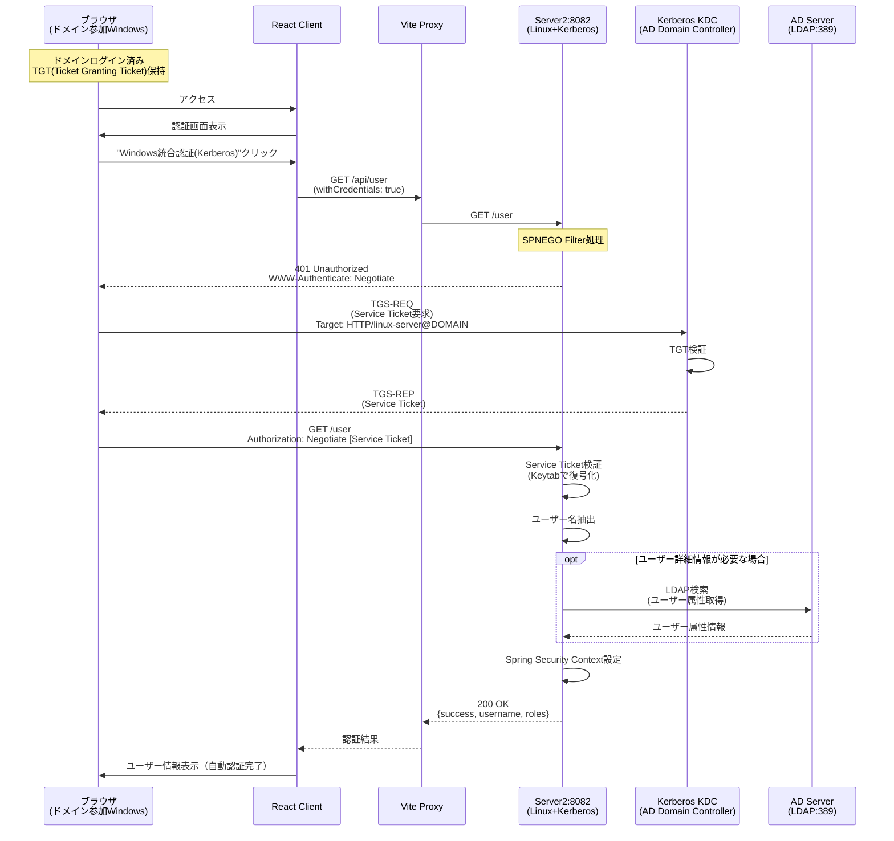
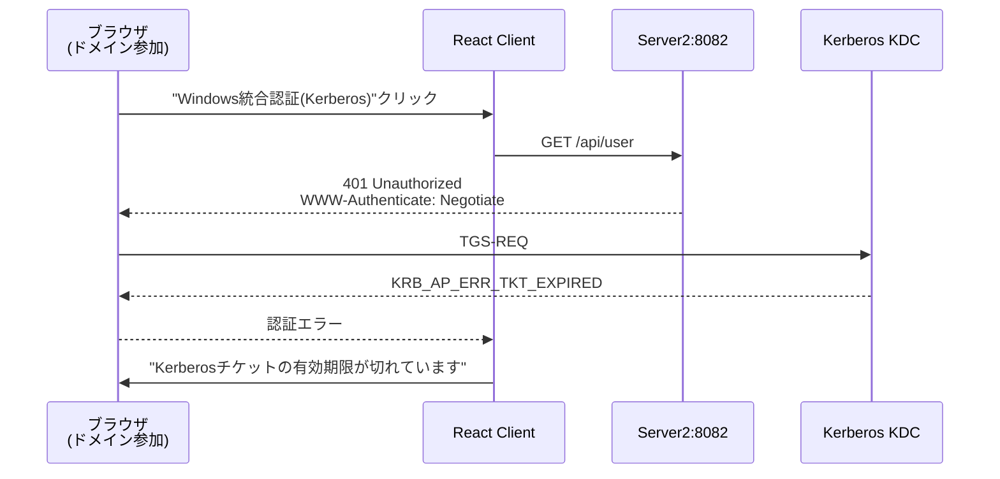
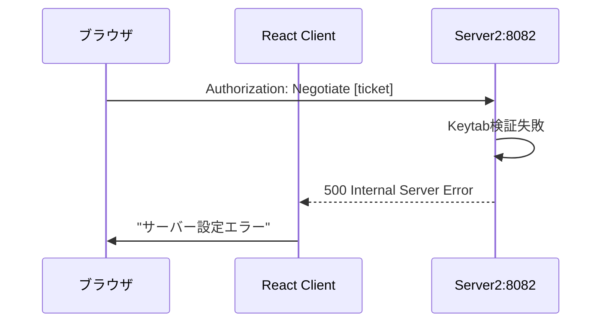
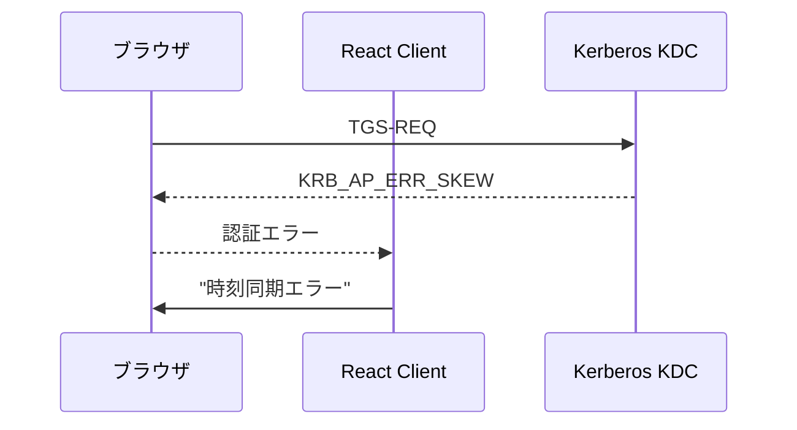

# Kerberos自動認証 実装・運用ガイド

## 概要
Server2 パターンBは、ドメイン参加クライアント + Linux非ドメインサーバーでのKerberos自動認証方式です。ユーザーはID/パスワードの入力なしで、WindowsのドメインログインだけでWebアプリケーションに自動認証されます。

## アーキテクチャ
**前提**: ドメイン参加クライアント + Linux非ドメインサーバー

### システム構成
- **サーバー**: Linuxサーバー、非ドメイン参加、Keytab配置
- **クライアント**: Windowsクライアント、ドメイン参加必須
- **認証方式**: Kerberos (SPNEGO)
- **ユーザー操作**: 不要（自動認証）

## シーケンス図


```mermaid
sequenceDiagram
    participant Browser as ブラウザ<br/>(ドメイン参加Windows)
    participant Client as React Client
    participant Proxy as Vite Proxy
    participant Server2 as Server2:8082<br/>(Linux+Kerberos)
    participant KDC as Kerberos KDC<br/>(AD Domain Controller)
    participant LDAP as AD Server<br/>(LDAP:389)

    Note over Browser: ドメインログイン済み<br/>TGT(Ticket Granting Ticket)保持

    Browser->>Client: アクセス
    Client->>Browser: 認証画面表示
    Browser->>Client: "Windows統合認証(Kerberos)"クリック

    Client->>Proxy: GET /api/user<br/>(withCredentials: true)
    Proxy->>Server2: GET /user

    Note over Server2: SPNEGO Filter処理
    Server2-->>Browser: 401 Unauthorized<br/>WWW-Authenticate: Negotiate

    Browser->>KDC: TGS-REQ<br/>(Service Ticket要求)<br/>Target: HTTP/linux-server@DOMAIN
    KDC->>KDC: TGT検証
    KDC-->>Browser: TGS-REP<br/>(Service Ticket)

    Browser->>Server2: GET /user<br/>Authorization: Negotiate [Service Ticket]

    Server2->>Server2: Service Ticket検証<br/>(Keytabで復号化)
    Server2->>Server2: ユーザー名抽出
    
    opt ユーザー詳細情報が必要な場合
        Server2->>LDAP: LDAP検索<br/>(ユーザー属性取得)
        LDAP-->>Server2: ユーザー属性情報
    end

    Server2->>Server2: Spring Security Context設定
    Server2-->>Proxy: 200 OK<br/>{success, username, roles}
    Proxy-->>Client: 認証結果

    Client->>Browser: ユーザー情報表示（自動認証完了）
```

## 技術仕様

### 必要なライブラリ
- **Spring Security Kerberos**: メイン認証ライブラリ
- **認証プロバイダー**: KerberosAuthenticationProvider
- **フィルター**: SpnegoAuthenticationProcessingFilter

### サーバー設定

#### Spring Boot設定 (application.properties)
```properties
# Kerberos設定
kerberos.principal=HTTP/server.domain.com@DOMAIN.COM
kerberos.keytab=/etc/krb5.keytab
kerberos.debug=true

# AD/LDAP設定
ad.domain=DOMAIN.COM
ad.url=ldap://dc.domain.com:389
ad.user-search-base=DC=domain,DC=com
ad.user-search-filter=sAMAccountName={0}

# サーバー設定
server.port=8082
```

#### Krb5設定ファイル (/etc/krb5.conf)
```ini
[libdefaults]
    default_realm = DOMAIN.COM
    dns_lookup_realm = false
    dns_lookup_kdc = false
    ticket_lifetime = 24h
    renew_lifetime = 7d
    forwardable = true

[realms]
    DOMAIN.COM = {
        kdc = dc1.domain.com
        kdc = dc2.domain.com
        admin_server = dc1.domain.com
    }

[domain_realm]
    .domain.com = DOMAIN.COM
    domain.com = DOMAIN.COM
```

### 必要なファイル
1. **`/etc/krb5.conf`** - Kerberos設定ファイル
2. **`/etc/krb5.keytab`** - サービスアカウント認証情報（権限600）

### Keytabファイル作成手順

#### Windows Active Directory側
```powershell
# サービスプリンシパル名の作成
setspn -A HTTP/linux-server.domain.com service-account

# Keytabファイル生成
ktpass -out C:\temp\krb5.keytab ^
       -princ HTTP/linux-server.domain.com@DOMAIN.COM ^
       -mapUser service-account@domain.com ^
       -mapOp set ^
       -pass ServiceAccountPassword ^
       -crypto AES256-SHA1 ^
       -pType KRB5_NT_PRINCIPAL
```

#### Linux サーバー側
```bash
# Keytabファイル配置
sudo cp krb5.keytab /etc/
sudo chown root:root /etc/krb5.keytab
sudo chmod 600 /etc/krb5.keytab

# Keytab検証
sudo klist -k /etc/krb5.keytab
sudo kinit -kt /etc/krb5.keytab HTTP/linux-server.domain.com@DOMAIN.COM
sudo klist
```

## Spring Security設定例

### SecurityConfig.java
```java
@Configuration
@EnableWebSecurity
public class KerberosConfig {

    @Value("${kerberos.principal}")
    private String servicePrincipal;

    @Value("${kerberos.keytab}")
    private String keytabLocation;

    @Bean
    public SpnegoEntryPoint spnegoEntryPoint() {
        return new SpnegoEntryPoint("/login");
    }

    @Bean
    public SpnegoAuthenticationProcessingFilter spnegoAuthenticationProcessingFilter(
            AuthenticationManager authenticationManager) {
        SpnegoAuthenticationProcessingFilter filter = 
            new SpnegoAuthenticationProcessingFilter();
        filter.setAuthenticationManager(authenticationManager);
        return filter;
    }

    @Bean
    public KerberosAuthenticationProvider kerberosAuthenticationProvider() {
        KerberosAuthenticationProvider provider = 
            new KerberosAuthenticationProvider();
        SunJaasKerberosClient client = new SunJaasKerberosClient();
        client.setDebug(true);
        provider.setKerberosClient(client);
        provider.setUserDetailsService(dummyUserDetailsService());
        return provider;
    }

    @Bean
    public KerberosServiceAuthenticationProvider kerberosServiceAuthenticationProvider() {
        KerberosServiceAuthenticationProvider provider = 
            new KerberosServiceAuthenticationProvider();
        provider.setTicketValidator(sunJaasKerberosTicketValidator());
        provider.setUserDetailsService(ldapUserDetailsService());
        return provider;
    }

    @Bean
    public SunJaasKerberosTicketValidator sunJaasKerberosTicketValidator() {
        SunJaasKerberosTicketValidator ticketValidator = 
            new SunJaasKerberosTicketValidator();
        ticketValidator.setServicePrincipal(servicePrincipal);
        ticketValidator.setKeyTabLocation(new FileSystemResource(keytabLocation));
        ticketValidator.setDebug(true);
        return ticketValidator;
    }
}
```

## エラーハンドリング

### 一般的なエラーパターン

#### 1. Kerberosチケット取得失敗

```mermaid
sequenceDiagram
    participant Browser as ブラウザ<br/>(ドメイン参加)
    participant Client as React Client
    participant Server2 as Server2:8082
    participant KDC as Kerberos KDC

    Browser->>Client: "Windows統合認証(Kerberos)"クリック
    Client->>Server2: GET /api/user
    Server2-->>Browser: 401 Unauthorized<br/>WWW-Authenticate: Negotiate
    
    Browser->>KDC: TGS-REQ
    KDC-->>Browser: KRB_AP_ERR_TKT_EXPIRED
    Browser-->>Client: 認証エラー
    Client->>Browser: "Kerberosチケットの有効期限が切れています"
```

#### 2. Keytab/SPN設定エラー

```mermaid
sequenceDiagram
    participant Browser as ブラウザ
    participant Client as React Client
    participant Server2 as Server2:8082

    Browser->>Server2: Authorization: Negotiate [ticket]
    Server2->>Server2: Keytab検証失敗
    Server2-->>Client: 500 Internal Server Error
    Client->>Browser: "サーバー設定エラー"
```

#### 3. 時刻同期エラー

```mermaid
sequenceDiagram
    participant Browser as ブラウザ
    participant Client as React Client
    participant KDC as Kerberos KDC

    Browser->>KDC: TGS-REQ
    KDC-->>Browser: KRB_AP_ERR_SKEW
    Browser-->>Client: 認証エラー
    Client->>Browser: "時刻同期エラー"
```

## トラブルシューティング

### よくある問題と解決方法

#### Keytab関連
**問題**: Keytabファイルのパスまたは権限が正しくない
```bash
# 解決方法
sudo ls -la /etc/krb5.keytab
sudo chown root:root /etc/krb5.keytab
sudo chmod 600 /etc/krb5.keytab
```

**問題**: SPNが正しく作成されていない
```powershell
# 確認方法
setspn -L service-account

# 修正方法
setspn -A HTTP/linux-server.domain.com service-account
```

**問題**: Keytabファイルの暗号化方式がマッチしない
```bash
# 確認方法
sudo klist -k /etc/krb5.keytab

# 修正方法（ktpassで再作成）
ktpass -crypto AES256-SHA1
```

#### 時刻同期問題
**問題**: LinuxサーバーとADドメインコントローラーの時刻差（5分以上）
```bash
# 確認方法
timedatectl status
ntpq -p

# 修正方法
sudo systemctl enable --now ntp
sudo ntpdate -s dc1.domain.com
```

#### ネットワーク問題
**問題**: DNS解決ができない（KDCが見つからない）
```bash
# 確認方法
nslookup dc1.domain.com
dig SRV _kerberos._tcp.domain.com

# 修正方法（/etc/hosts に追加）
192.168.1.10 dc1.domain.com
```

**問題**: Kerberosポート（88/tcp, 88/udp）がブロックされている
```bash
# 確認方法
telnet dc1.domain.com 88
nc -u dc1.domain.com 88

# ファイアウォール設定確認
sudo ufw status
```

### デバッグ設定

#### アプリケーションログ
```properties
# application.properties
logging.level.org.springframework.security.kerberos=DEBUG
logging.level.org.springframework.security.web=DEBUG
kerberos.debug=true
```

#### JVM システムプロパティ
```bash
# Java起動オプション
-Dsun.security.krb5.debug=true
-Djava.security.debug=gssloginconfig,configfile,configparser,logincontext
-Djava.security.krb5.conf=/etc/krb5.conf
```

#### Kerberos動作確認
```bash
# 手動でのKerberos認証テスト
kinit username@DOMAIN.COM
klist
kvno HTTP/linux-server.domain.com@DOMAIN.COM
```

## セキュリティ考慮事項

### Keytabファイル保護
- **ファイル権限**: 600（owner読み書きのみ）
- **定期ローテーション**: 定期的なパスワード変更とKeytab再作成
- **アクセス制御**: rootユーザーのみアクセス可能

### 時刻同期
- **厳密な時刻同期**: ADドメインコントローラーとの時刻差5分以内
- **NTPサービス**: 安定したNTPサーバーとの同期
- **監視**: 時刻ずれの監視とアラート

### ネットワークセキュリティ
- **DNS設定**: 正しいDNS設定とDNSSEC
- **ファイアウォール**: 必要なポートのみ開放
- **HTTPS**: 本番環境では必須

### SPN管理
- **一意性**: SPNの重複を避ける
- **命名規則**: 一貫したSPN命名規則
- **定期監査**: SPN設定の定期確認

## 運用監視

### 監視項目
1. **認証成功率**: Kerberos認証の成功/失敗率
2. **レスポンス時間**: 認証処理時間の監視
3. **エラーログ**: 認証エラーの監視とアラート
4. **時刻同期**: NTPサーバーとの時刻差監視

### ログ解析
```bash
# 認証ログの確認
sudo grep "Kerberos" /var/log/spring-boot/application.log
sudo grep "SPNEGO" /var/log/spring-boot/application.log

# システムログの確認
sudo journalctl -u your-spring-app.service | grep -i kerberos
```

## パフォーマンス最適化

### キャッシュ設定
- **チケットキャッシュ**: Kerberosチケットのキャッシュ最適化
- **LDAP接続プール**: ADサーバーへの接続プール設定
- **セッション管理**: Spring Sessionの効率的な管理

### 負荷分散
- **複数KDC**: 冗長化されたKDCの活用
- **ロードバランサー**: sticky sessionの設定
- **ヘルスチェック**: Kerberos認証を含むヘルスチェック

このガイドにより、Server2 パターンB（Kerberos自動認証）の実装、運用、トラブルシューティングを効率的に行うことができます。