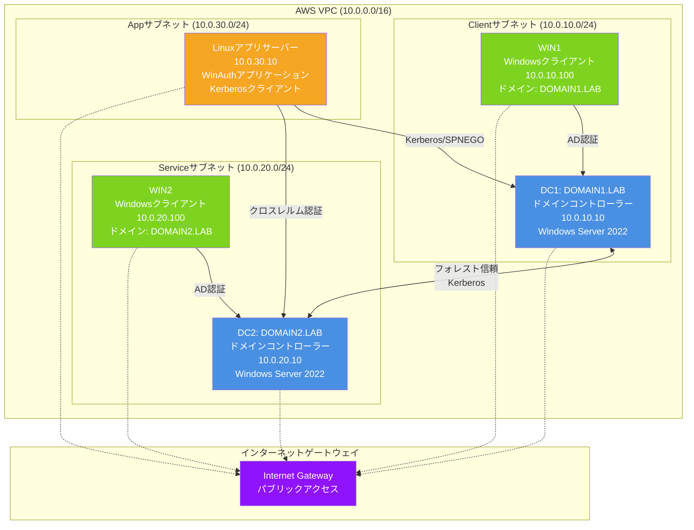
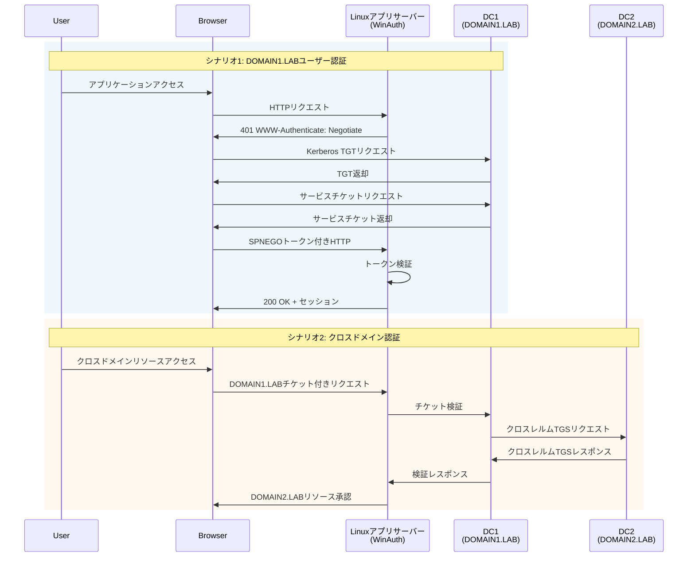

# AWS Kerberosテスト環境 - 完全デプロイメントガイド

## 概要
本ガイドは、AWS上でKerberos認証環境を構築・運用・管理するための包括的なドキュメントです。

**クイックスタートが必要な場合は `README_QUICK.md` を参照してください。**

### 対象読者
- AWS環境でKerberosテストを行う開発者
- Active Directory環境の設計・構築担当者
- Kerberos認証の学習・検証を行う技術者

## 前提条件

1. **AWSアカウント**（適切な権限付き）
2. **AWS CLI**がインストール・設定済み
3. **EC2キーペア**が対象リージョンに作成済み
4. **予算**: 継続運用で月額約100-120ドル

## アーキテクチャ

### ネットワーク構成
```
VPC (10.0.0.0/16)
├── Clientサブネット (10.0.10.0/24)
│   ├── DC1 - DOMAIN1.LABドメインコントローラー (10.0.10.10)
│   └── WIN1 - Windowsクライアント (10.0.10.100)
├── Serviceサブネット (10.0.20.0/24)
│   ├── DC2 - DOMAIN2.LABドメインコントローラー (10.0.20.10)
│   └── WIN2 - Windowsクライアント (10.0.20.100)
└── Appサブネット (10.0.30.0/24)
    └── Linuxアプリケーションサーバー (10.0.30.10)
```

### システム構成図



### 認証フロー図



### コンポーネント詳細

| コンポーネント | インスタンスタイプ | OS | 用途 | 推定コスト |
|--------------|------------------|-----|------|-----------|
| DC1 | t3.medium | Windows Server 2022 | DOMAIN1.LABドメインコントローラー | 約$30/月 |
| DC2 | t3.medium | Windows Server 2022 | DOMAIN2.LABドメインコントローラー | 約$30/月 |
| WIN1 | t3.small | Windows Server 2022 | DOMAIN1.LABテストクライアント | 約$15/月 |
| WIN2 | t3.small | Windows Server 2022 | DOMAIN2.LABテストクライアント | 約$15/月 |
| Linuxアプリ | t3.small | Amazon Linux 2 | アプリケーションサーバー | 約$15/月 |
| ネットワーク | - | - | VPC、サブネット、IGW | 約$10/月 |

## デプロイメント方法

### クイックデプロイ（推奨）
```bash
./quick-deploy.sh <キーペア名> <パスワード> [プレフィックス] [オーナー]
```

詳細は `README_QUICK.md` を参照してください。

### 手動デプロイ（上級者向け）

CloudFormationを直接使用する場合：

```bash
aws cloudformation create-stack \
  --stack-name my-kerberos-env \
  --template-body file://cloudformation.yaml \
  --parameters \
    ParameterKey=KeyName,ParameterValue=my-key \
    ParameterKey=AdminPassword,ParameterValue='MyStr0ngP@ssw0rd!' \
    ParameterKey=Prefix,ParameterValue=mytest \
    ParameterKey=Owner,ParameterValue=alice \
  --region ap-northeast-1 \
  --capabilities CAPABILITY_IAM
```

### 2. ドメインコントローラーの初期化待機

ドメインコントローラーは以下の処理のため10-15分必要です：
- Active Directory Domain Servicesのインストール
- ドメインコントローラーへの昇格
- 再起動と初期化

### 3. ドメイン設定の完了

#### DC1 (DOMAIN1.LAB)での作業:
```powershell
# CloudFormation出力のパブリックIPを使用してDC1にRDP接続
# Administratorでログイン（設定したパスワードを使用）

# テストユーザー作成スクリプトの実行
C:\setup-scripts\create-test-users.ps1 -Domain "DOMAIN1.LAB"

# 信頼関係の設定（DC2の準備完了後）
C:\setup-scripts\configure-trust.ps1 `
  -LocalDomain "DOMAIN1.LAB" `
  -RemoteDomain "DOMAIN2.LAB" `
  -RemoteDC "10.0.20.10" `
  -TrustPassword "TrustP@ss123!"
```

#### DC2 (DOMAIN2.LAB)での作業:
```powershell
# DC2にRDP接続
# DOMAIN2.LABドメイン用の同様のコマンドを実行
C:\setup-scripts\create-test-users.ps1 -Domain "DOMAIN2.LAB"

C:\setup-scripts\configure-trust.ps1 `
  -LocalDomain "DOMAIN2.LAB" `
  -RemoteDomain "DOMAIN1.LAB" `
  -RemoteDC "10.0.10.10" `
  -TrustPassword "TrustP@ss123!"
```

### 4. Windowsクライアントのドメイン参加

WIN1での作業（DOMAIN1.LABドメインへ参加）:
```powershell
# WIN1にRDP接続
# DOMAIN1.LABドメインに参加
Add-Computer -DomainName "DOMAIN1.LAB" `
  -Credential (Get-Credential CLIENT\Administrator) `
  -Restart
```

WIN2での作業（DOMAIN2.LABドメインへ参加）:
```powershell
# WIN2にRDP接続
# DOMAIN2.LABドメインに参加
Add-Computer -DomainName "DOMAIN2.LAB" `
  -Credential (Get-Credential SERVICE\Administrator) `
  -Restart
```

### 5. Linuxサーバーの設定

```bash
# LinuxサーバーにSSH接続
ssh -i your-key.pem ec2-user@<linux-public-ip>

# Kerberos設定の実行
chmod +x /tmp/configure-linux-kerberos.sh
sudo /tmp/configure-linux-kerberos.sh

# DC1からkeytabをコピー（SCPまたは手動転送）
# /etc/kerberos/svcapp.keytabに配置
sudo chmod 600 /etc/kerberos/svcapp.keytab

# Kerberosテスト
kinit -kt /etc/kerberos/svcapp.keytab svcapp@DOMAIN1.LAB
klist
```

## 環境のテスト

### 1. ドメインユーザーでのログイン

#### WIN1へのログイン
```
# リモートデスクトップ接続
mstsc /v:<WIN1のパブリックIP>

# ログイン情報
ユーザー名: DOMAIN1\user1
パスワード: 設定したユーザーパスワード

# 管理者権限が必要な場合
ユーザー名: DOMAIN1\Administrator
パスワード: 設定したAdminPassword
```

#### WIN2へのログイン
```
# リモートデスクトップ接続
mstsc /v:<WIN2のパブリックIP>

# ログイン情報
ユーザー名: DOMAIN2\user2
パスワード: 設定したユーザーパスワード

# 管理者権限が必要な場合
ユーザー名: DOMAIN2\Administrator
パスワード: 設定したAdminPassword
```

### 2. クロスドメイン信頼のテスト
```powershell
# DC1で実行
nltest /trusted_domains

# WIN1で実行（DOMAIN1\user1としてログイン）
nltest /dsgetdc:DOMAIN2.LAB

# WIN2で実行（DOMAIN2\user2としてログイン）
nltest /dsgetdc:DOMAIN1.LAB
```

### 2. Kerberos認証テスト
```bash
# Linuxサーバーで実行
# DOMAIN1.LABユーザーでテスト
kinit user1@DOMAIN1.LAB
klist

# DOMAIN2.LABユーザーでテスト（クロスレルム）
kinit user2@DOMAIN2.LAB
klist
```

### 3. WinAuthアプリケーションのデプロイ
```bash
# Linuxサーバーで実行
cd /opt/winauth

# アプリケーションJARをコピー
sudo wget your-app-url/winauth.jar

# Kerberosプロファイルで起動
sudo java -Dspring.profiles.active=kerberos \
  -Djava.security.krb5.conf=/etc/krb5.conf \
  -jar winauth.jar
```

## コスト管理

### 月額コスト見積もり（東京リージョン）
- DC1 & DC2 (t3.medium): 約$60
- WIN1 & WIN2 (t3.small): 約$30
- Linux (t3.small): 約$15
- ストレージ & ネットワーク: 約$5
- **合計**: 約$110/月

**注意**: Elastic IPを使用しないため、従来の見積もりより約$20/月安くなります

### コスト削減のヒント

1. **使用しない時はインスタンスを停止**:
```bash
# インスタンスIDを指定して停止
aws ec2 stop-instances --instance-ids <instance-ids> --region ap-northeast-1

# 再開時（注意：パブリックIPが変更される可能性があります）
aws ec2 start-instances --instance-ids <instance-ids> --region ap-northeast-1
```

2. **AWS Instance Scheduler**を使用した自動起動/停止

3. **テスト後のクリーンアップ**:
```bash
aws cloudformation delete-stack --stack-name $STACK_NAME --region ap-northeast-1
```

### 重要な注意事項

1. **パブリックIPの変更**
   - インスタンス停止/起動時にパブリックIPアドレスが変更される場合があります
   - 固定IPが必要な場合は、別途Elastic IPを設定してください

2. **リージョン設定**
   - デフォルトで東京リージョン（ap-northeast-1）に作成されます
   - AWS CLIコマンドには `--region ap-northeast-1` を含めてください

## トラブルシューティング

### ドメインコントローラーにアクセスできない
- セキュリティグループのルールを確認
- インスタンスが完全に起動していることを確認（10-15分待機）
- Windowsファイアウォールの設定を確認

### WIN1/WIN2のドメイン参加が失敗する場合

#### 自動参加が失敗した場合の確認手順
```powershell
# WIN1/WIN2にRDP接続後、Administratorでログイン

# 1. スケジュールタスクの実行状態を確認
Get-ScheduledTask -TaskName "JoinDomain" | Get-ScheduledTaskInfo

# 2. ドメイン参加ログを確認
Get-Content C:\join-domain.log

# 3. UserDataの実行ログを確認
Get-Content C:\UserData-execution.log

# 4. DNS設定を確認
ipconfig /all
nslookup DOMAIN1.LAB  # WIN1の場合
nslookup DOMAIN2.LAB  # WIN2の場合
```

#### 手動でのドメイン参加手順
```powershell
# WIN1をDOMAIN1.LABに参加させる場合
$password = ConvertTo-SecureString "設定したAdminPassword" -AsPlainText -Force
$credential = New-Object System.Management.Automation.PSCredential("DOMAIN1\Administrator", $password)
Add-Computer -DomainName "DOMAIN1.LAB" -Credential $credential -Force -Restart

# WIN2をDOMAIN2.LABに参加させる場合
$password = ConvertTo-SecureString "設定したAdminPassword" -AsPlainText -Force
$credential = New-Object System.Management.Automation.PSCredential("DOMAIN2\Administrator", $password)
Add-Computer -DomainName "DOMAIN2.LAB" -Credential $credential -Force -Restart
```

#### ドメイン参加後の確認
```powershell
# 再起動後、ドメインユーザーでログイン
# WIN1: DOMAIN1\user1
# WIN2: DOMAIN2\user2

# ドメイン参加状態を確認
Get-ComputerInfo | Select CsDomain, CsDomainRole
whoami /fqdn
```

### Kerberos認証が失敗する
- 時刻同期を確認（Kerberosには必須）
- DNS解決を確認
- keytabのパーミッション確認（600）
- SPNの確認: `setspn -L svcapp`

### 信頼関係の問題

#### 信頼関係の確認手順
```powershell
# DC1で実行（DOMAIN1.LAB）
Get-ADTrust -Identity "DOMAIN2.LAB" -Properties *
nltest /trusted_domains

# DC2で実行（DOMAIN2.LAB）
Get-ADTrust -Identity "DOMAIN1.LAB" -Properties *
nltest /trusted_domains
```

#### 信頼関係のログ確認
```powershell
# 両DCで実行
Get-Content C:\trust-setup.log
Get-ScheduledTask -TaskName "SetupTrust" | Get-ScheduledTaskInfo
```

#### 手動での信頼関係設定
```powershell
# DC1で実行（DOMAIN1.LAB → DOMAIN2.LAB）
$trustPassword = ConvertTo-SecureString "TrustP@ss123!" -AsPlainText -Force
New-ADTrust -Name "DOMAIN2.LAB" -Type Forest -Direction BiDirectional -TrustPassword $trustPassword -Confirm:$false

# DC2で実行（DOMAIN2.LAB → DOMAIN1.LAB）
$trustPassword = ConvertTo-SecureString "TrustP@ss123!" -AsPlainText -Force
New-ADTrust -Name "DOMAIN1.LAB" -Type Forest -Direction BiDirectional -TrustPassword $trustPassword -Confirm:$false
```

#### 信頼関係のテスト
```powershell
# DC1からDC2のユーザーを検索
Get-ADUser -Identity "user2" -Server "DOMAIN2.LAB"

# DC2からDC1のユーザーを検索
Get-ADUser -Identity "user1" -Server "DOMAIN1.LAB"

# 信頼関係の動作テスト
nltest /dsgetdc:DOMAIN2.LAB  # DC1で実行
nltest /dsgetdc:DOMAIN1.LAB  # DC2で実行
```

#### トラブルシューティング
- 両DCが相互のDNSを解決できることを確認
- サブネット間のネットワーク接続性を確認
- 信頼パスワードが両側で一致していることを確認
- 両DCでActive Directoryサービスが正常に動作していることを確認

## クリーンアップ

継続的な課金を避けるため：

```bash
# スタックを削除（全リソースを削除）
aws cloudformation delete-stack \
  --stack-name $STACK_NAME \
  --region $REGION

# 削除完了を確認
aws cloudformation wait stack-delete-complete \
  --stack-name $STACK_NAME \
  --region $REGION
```

## セキュリティ注意事項

1. **デフォルトパスワードは即座に変更**
2. 本番環境では**セキュリティグループのルールを制限**
3. AWSアカウントアクセスに**MFAを有効化**
4. 可能な限り**Systems Manager Session Manager**を使用（RDP/SSHの代わり）
5. 監査ログ用に**CloudTrailを有効化**

## 次のステップ

1. アプリケーションのKerberos設定を構成
2. クロスドメイン認証シナリオをテスト
3. CloudWatchでモニタリング設定
4. ドメインコントローラーのバックアップ戦略を実装
5. 特定のテストケースと結果を文書化