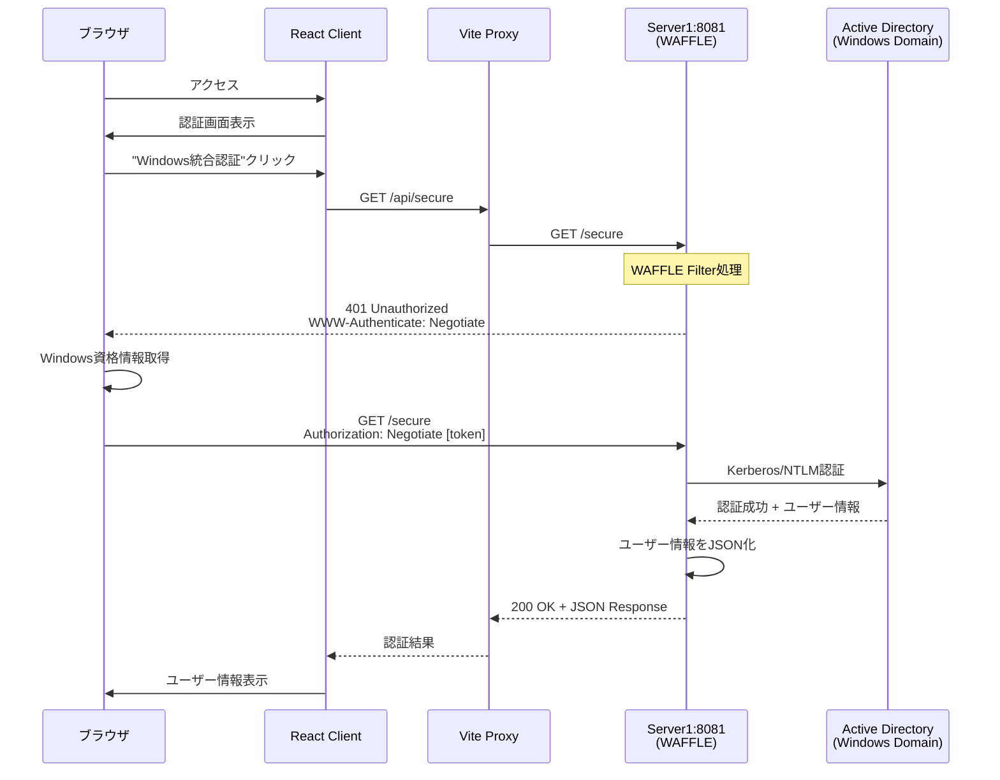
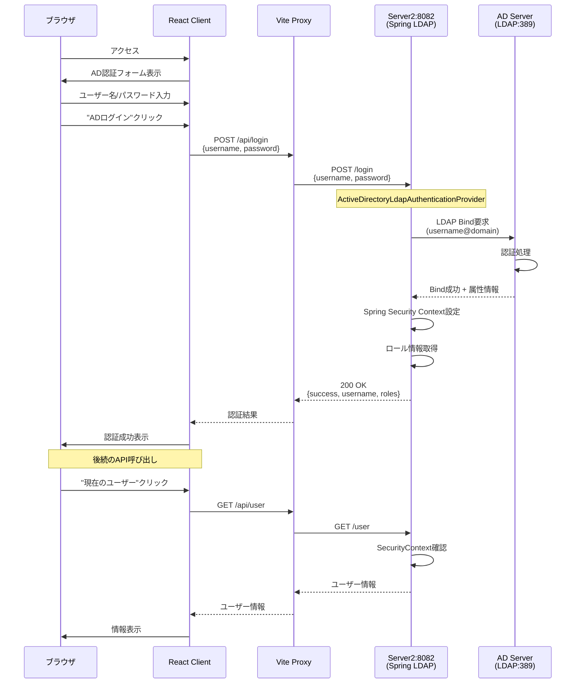
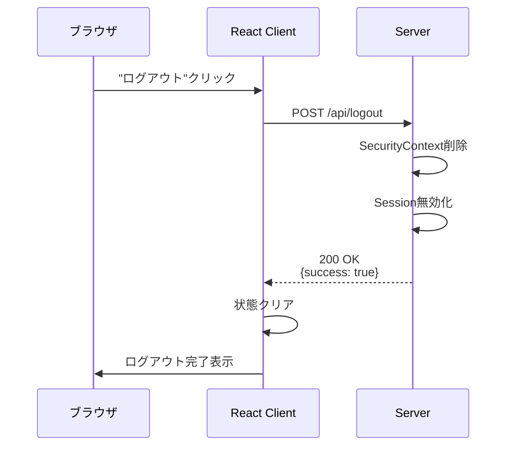
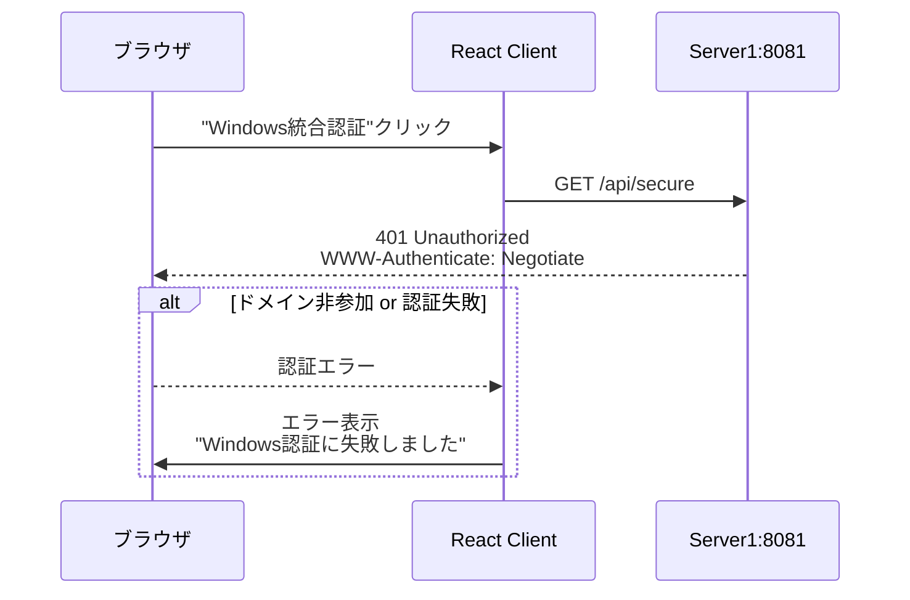
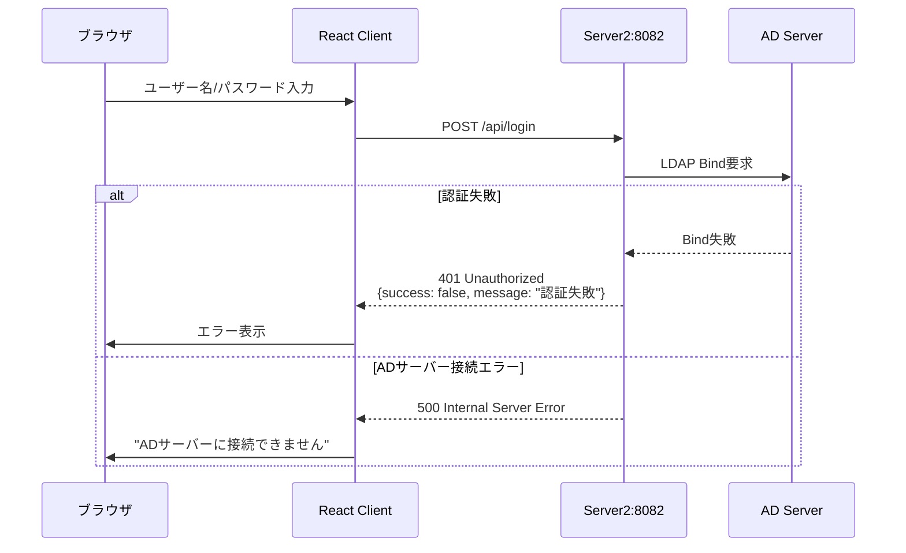

# Windows/AD認証シーケンス図

このドキュメントでは、2つの認証サーバーの動作フローをシーケンス図で説明します。

## Server1 (Windows統合認証 - WAFFLE) シーケンス図



### Server1の特徴
- **前提条件**: クライアントPCがWindowsドメインに参加している必要がある
- **認証方式**: Kerberos/NTLM (Negotiate)
- **ユーザー操作**: 不要（ブラウザが自動的に資格情報を送信）
- **プロトコル**: Windows統合認証（SPNEGO）

## Server2 (AD認証 - フォームベース) シーケンス図



### Server2の特徴
- **前提条件**: ドメイン参加不要（ADサーバーへのネットワーク接続のみ必要）
- **認証方式**: LDAP Bind
- **ユーザー操作**: ユーザー名とパスワードの入力が必要
- **プロトコル**: LDAP (port 389) または LDAPS (port 636)

## ログアウトフロー（両サーバー共通）



## エラーハンドリング

### Server1 - Windows統合認証エラー


### Server2 - AD認証エラー


## 技術仕様

### Server1 (WAFFLE)
- **ライブラリ**: WAFFLE (Windows Authentication Framework)
- **認証ヘッダー**: `Authorization: Negotiate <base64-token>`
- **セキュリティプロバイダー**: NegotiateSecurityFilterProvider
- **必要な設定**: なし（Windowsドメイン環境で自動動作）

### Server2 (Spring LDAP)
- **ライブラリ**: Spring Security LDAP
- **認証プロバイダー**: ActiveDirectoryLdapAuthenticationProvider
- **必要な設定**:
  ```properties
  ad.domain=YOUR_DOMAIN.COM
  ad.url=ldap://YOUR_AD_SERVER:389
  ```
- **サポートする認証形式**:
  - `DOMAIN\username`
  - `username@domain.com`

## セキュリティ考慮事項

1. **Server1**: 
   - HTTPSの使用を推奨（Kerberosトークンの保護）
   - SPNの適切な設定が必要

2. **Server2**:
   - HTTPSの使用を強く推奨（パスワードの保護）
   - LDAPS（SSL/TLS）の使用を検討
   - CSRFトークンの実装（本番環境）

## トラブルシューティング

### Server1の一般的な問題
- ブラウザがNegotiate認証をサポートしていない
- クライアントPCがドメインに参加していない
- Kerberosチケットの有効期限切れ

### Server2の一般的な問題
- ADサーバーへの接続がファイアウォールでブロックされている
- ユーザー名の形式が正しくない
- LDAP検索ベースDNの設定ミス